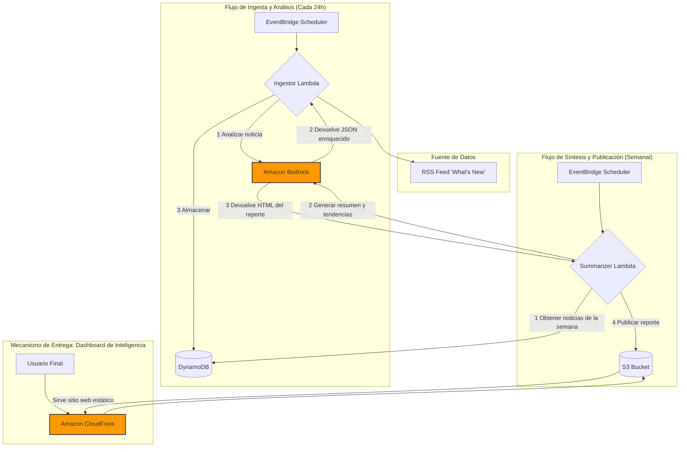

¡Claro que sí\! Aquí tienes el contenido completo del archivo `README.md` en texto plano para que puedas copiarlo y pegarlo.

-----

# Cloud Lighthouse  Lighthouse

**Transformando el torrente de noticias de AWS en inteligencia accionable y contextualizada.**

Cloud Lighthouse es un sistema automatizado que monitorea el blog "What's New with AWS", utiliza IA para analizar y enriquecer cada noticia, y presenta los hallazgos en un dashboard de inteligencia, ayudando a los equipos a navegar de forma segura y a tomar decisiones proactivas sobre costos, rendimiento y estrategia en la nube.

### [➡️ Ver el Dashboard de Inteligencia (Demo)](https://www.google.com/search?q=https://your-cloudfront-url.com)

-----

## Índice

  - [El Problema](https://www.google.com/search?q=%23el-problema)
  - [La Solución: Cloud Lighthouse](https://www.google.com/search?q=%23la-soluci%C3%B3n-cloud-lighthouse)
  - [Características Principales](https://www.google.com/search?q=%23caracter%C3%ADsticas-principales)
  - [Diagrama de Arquitectura](https://www.google.com/search?q=%23diagrama-de-arquitectura)
  - [Stack Tecnológico](https://www.google.com/search?q=%23stack-tecnol%C3%B3gico)
  - [Desarrollo Local](https://www.google.com/search?q=%23desarrollo-local)
      - [Prerrequisitos](https://www.google.com/search?q=%23prerrequisitos)
      - [Instalación](https://www.google.com/search?q=%23instalaci%C3%B3n)
  - [Despliegue en AWS](https://www.google.com/search?q=%23despliegue-en-aws)
  - [Roadmap a Futuro](https://www.google.com/search?q=%23roadmap-a-futuro)
  - [Cómo Contribuir](https://www.google.com/search?q=%23c%C3%B3mo-contribuir)
  - [Licencia](https://www.google.com/search?q=%23licencia)

-----

## El Problema

El ritmo de innovación de Amazon Web Services es implacable. Cada día se anuncian nuevas funciones, servicios y optimizaciones de precios. Para los equipos de ingeniería y DevOps, navegar este mar de información para mantenerse al día es una tarea manual que consume un tiempo valioso. Oportunidades críticas para reducir costos, mejorar el rendimiento o adoptar ventajas competitivas a menudo se descubren tarde o se pierden por completo en la niebla informativa.

## La Solución: Cloud Lighthouse

**Cloud Lighthouse** actúa como un faro en la niebla del ecosistema de la nube. Ilumina el camino a través del flujo constante de noticias, guiando hacia las actualizaciones más importantes y seguras.

Este sistema automatizado:

1.  **Monitorea** el feed oficial de noticias de AWS cada día.
2.  **Analiza** cada noticia con un Modelo de Lenguaje Grande (LLM) para extraer su esencia: a qué servicio afecta, qué tipo de beneficio ofrece (costo, seguridad, rendimiento) y cuál es su impacto.
3.  **Almacena** esta información enriquecida, creando una base de conocimiento histórica.
4.  **Sintetiza** un reporte semanal inteligente que se publica en un dashboard interactivo, transformando la niebla en una señal clara.

## Características Principales

  - **Análisis Impulsado por IA:** Utiliza Amazon Bedrock para categorizar, resumir y extraer entidades clave de cada noticia.
  - **Arquitectura 100% Serverless:** Costo-eficiente y escalable desde el primer día, con un costo operativo cercano a $0 para un uso moderado gracias a la capa gratuita de AWS.
  - **Dashboard de Inteligencia:** Un panel web limpio y rápido para visualizar los reportes semanales, en lugar de saturar la bandeja de entrada del correo.
  - **Base de Conocimiento Histórica:** Todos los análisis se almacenan en DynamoDB, permitiendo futuras consultas y análisis de tendencias a largo plazo.
  - **Infraestructura como Código (IaC):** Todo el stack se define y versiona utilizando el AWS Serverless Application Model (SAM), permitiendo un despliegue consistente y repetible.

## Diagrama de Arquitectura



## Stack Tecnológico

  - **Computo:** AWS Lambda (Python 3.11)
  - **IA Generativa:** Amazon Bedrock (Modelo Claude)
  - **Base de Datos:** Amazon DynamoDB
  - **Almacenamiento y Hosting:** Amazon S3
  - **Red de Entrega de Contenido (CDN):** Amazon CloudFront
  - **Orquestación y Eventos:** Amazon EventBridge Scheduler
  - **Framework de Despliegue:** AWS Serverless Application Model (SAM)

## Desarrollo Local

### Prerrequisitos

  - Cuenta de AWS con credenciales configuradas localmente.
  - AWS SAM CLI instalado.
  - Python 3.11 o superior.
  - Docker (para las pruebas locales de SAM).

### Instalación

1.  **Clonar el repositorio:**

    ```bash
    git clone https://github.com/tu-usuario/cloud-lighthouse.git
    cd cloud-lighthouse
    ```

2.  **Construir el proyecto:**
    El comando `sam build` compilará las dependencias de las funciones Lambda.

    ```bash
    sam build
    ```

3.  **(Opcional) Invocar una función localmente:**
    Puedes probar la función de ingesta localmente para depurar. Necesitarás un archivo de evento de prueba (`events/event-ingestor.json`).

    ```bash
    sam local invoke IngestorFunction -e events/event-ingestor.json
    ```

## Despliegue en AWS

El despliegue se gestiona completamente a través del CLI de AWS SAM.

1.  **Construir la aplicación:**

    ```bash
    sam build
    ```

2.  **Desplegar con el asistente guiado:**
    La primera vez, usa el modo guiado. SAM te preguntará por los parámetros de configuración (nombre del stack, región, etc.) y creará un archivo `samconfig.toml` para futuros despliegues.

    ```bash
    sam deploy --guided
    ```

3.  **Despliegues futuros:**
    Una vez que `samconfig.toml` está creado, los despliegues posteriores son más simples:

    ```bash
    sam deploy
    ```

Al finalizar, la salida del comando `sam deploy` te proporcionará la URL del endpoint de CloudFront para tu dashboard.

## Roadmap a Futuro

  - [ ] **Alertas Personalizadas:** Permitir a los usuarios configurar alertas por email o Slack para servicios o palabras clave específicas.
  - [ ] **Dashboard Interactivo:** Reemplazar el HTML estático con una aplicación de una sola página (SPA) usando Vue o React para permitir filtros, búsquedas y visualizaciones.
  - [ ] **Análisis de Tendencias a Largo Plazo:** Crear una función que analice los datos de DynamoDB mensualmente para identificar patrones de inversión de AWS a lo largo del tiempo.
  - [ ] **API Pública:** Exponer los datos analíticos a través de una API Gateway para que otros servicios puedan consumirlos.

## Cómo Contribuir

¡Las contribuciones son bienvenidas\! Por favor, lee `CONTRIBUTING.md` para conocer los detalles sobre nuestro código de conducta y el proceso para enviar pull requests.

## Licencia

Este proyecto está bajo la Licencia MIT. Ver el archivo `LICENSE` para más detalles.
